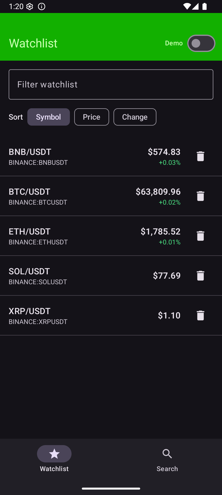
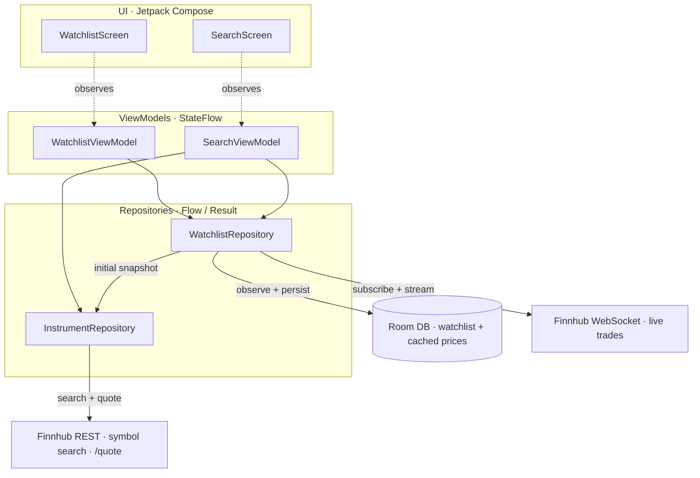

# Real-Time Watchlist

A small Android app that lets you **search** financial instruments (crypto), maintain a
**persistent watchlist**, and watch **live price updates** stream in. Built with Kotlin, Jetpack
Compose, Coroutines/Flow, Hilt, Room, Retrofit, and OkHttp's WebSocket client, against the
[Finnhub](https://finnhub.io) API.

> **Runs with zero setup.** With no API key configured the app boots into **demo mode** and
> shows simulated, ticking prices — so a reviewer can experience the full flow offline, with no
> dependency on Finnhub availability, market hours, or rate limits.

<p align="center">
  
</p>

---

## Build & run

1. Open the project in Android Studio (Ladybug or newer), or build from the command line.
2. **Optional — enable live data:** get a free API key at
   <https://finnhub.io/register> and add it to `local.properties`:
   ```properties
   FINNHUB_API_KEY=your_key_here
   ```
   Leave it blank to stay in demo mode.
3. Run the `app` configuration on an emulator or device (minSdk 24).

Command line:
```bash
./gradlew assembleDebug        # build the APK
./gradlew testDebugUnitTest    # run the unit tests
```

The `local.properties` file (SDK location + API key) is intentionally **not** committed. A
template is included; set `sdk.dir` for your machine if building outside Android Studio.

---

## Demo / fake-data mode

Demo mode makes the core experience runnable without any external service.

- **Auto-on:** enabled by default whenever `FINNHUB_API_KEY` is blank.
- **Runtime toggle:** a **Demo** switch in the watchlist top bar flips between live and simulated
  data without a rebuild (the switch is locked on when no key is present, since live mode isn't
  possible). See [`DemoModeManager`](app/src/main/java/com/example/watchlist/data/DemoModeManager.kt).
- **What it simulates:** search over a fixed catalogue of well-known crypto pairs
  ([`DemoCatalog`](app/src/main/java/com/example/watchlist/data/demo/DemoCatalog.kt)) and a
  synthetic price stream that random-walks each price, periodically injecting a brief
  *reconnecting* blip so every UI state — live ticks, movement colors, staleness, reconnection —
  is observable. See
  [`FakePriceStreamClient`](app/src/main/java/com/example/watchlist/data/remote/stream/FakePriceStreamClient.kt).

Demo and live paths share the exact same interfaces (`InstrumentRepository`, `PriceStreamClient`),
so the UI and ViewModels are identical in both modes.

---

## Architecture

Single-module, layered, feature-packaged. Unidirectional data flow: repositories expose `Flow`s,
ViewModels fold them into immutable UI state exposed as `StateFlow`, Compose collects with
`collectAsStateWithLifecycle()`.



```
ui/            Compose screens + ViewModels (search, watchlist) + shared components
  search/      SearchScreen · SearchViewModel · SearchUiState
  watchlist/   WatchlistScreen · WatchlistViewModel · WatchlistUiState · WatchlistMapper
domain/model/  Instrument, WatchlistInstrument, PriceUpdate, ConnectionStatus, PriceMovement
data/
  remote/      FinnhubApi (REST) + dto
  remote/stream/  PriceStreamClient interface, Finnhub + Fake implementations, frame parsing
  local/       Room: WatchlistEntity, WatchlistDao, AppDatabase
  repository/  InstrumentRepository (search/snapshot) · WatchlistRepository (watchlist ⨝ prices)
  DemoModeManager, demo/DemoCatalog
di/            Hilt modules: Network, Database, Repository, Coroutines (scope/dispatcher/time)
```

### Live-price flow (the core)

1. **Room is the single source of truth** for the watchlist. `WatchlistDao.observeAll()` emits a
   fresh list on every change and survives app launches.
2. `WatchlistRepository` maps the watchlist to a distinct **set of symbols** and feeds it, as a
   `Flow`, into the active `PriceStreamClient`.
3. The Finnhub client keeps **one WebSocket** open, (re)subscribes the symbol set on connect, and
   sends incremental subscribe/unsubscribe frames as the watchlist changes — no reconnect needed.
4. Trade frames are parsed and folded (`scan`) into an in-memory `Map<symbol, PriceUpdate>`;
   connection events become a `ConnectionStatus` flow.
5. `WatchlistViewModel` `combine`s five inputs — watchlist, live prices, connection status,
   sort/filter choices, and a 1 Hz staleness ticker — into `WatchlistUiState`.
6. The stream is started lazily via `SharingStarted.WhileSubscribed`, so the socket is open only
   while the UI observes it and tears down shortly after the app is backgrounded.

### State handling

Every state the exercise calls out is represented explicitly:

| State | Where |
|---|---|
| Loading | `SearchUiState.Loading`, `WatchlistUiState.Loading` |
| Empty | `SearchUiState.Empty`, `WatchlistUiState.Empty` |
| Error (with retry) | `SearchUiState.Error(@StringRes)` → `ErrorState` |
| Missing price | `WatchlistItem.price == null` → "Waiting for price…" |
| Stale data | `WatchlistItem.isStale` (last tick older than 15 s) → dimmed row + "Stale" badge |
| Reconnecting | `ConnectionStatus` → `ConnectionBanner` |

### Error, reconnect & backoff

- REST errors are caught in the repository, `CancellationException` is rethrown (so superseded
  searches aren't turned into fake failures), and other failures become `Result.failure`, mapped
  to a localized message via `Throwable.toUserMessageRes()`.
- A missing REST snapshot is **not** an error — the row falls back to the cached price, then the
  first live tick.
- The WebSocket reconnects with **capped exponential backoff** (1s → 2s → … → 30s), re-subscribing
  all symbols on reconnect and surfacing `RECONNECTING` to the banner.

### Prices at startup (no waiting on the socket)

Prices appear immediately, before the WebSocket connects, via two REST/local mechanisms:

- **`/quote` on startup and add.** Finnhub's `/quote` endpoint returns the current price and works
  for crypto on the **free** plan (unlike `/crypto/candle`, which is premium → `403`). The
  watchlist ViewModel pulls `/quote` for every symbol on init (and on pull-to-refresh), so rows
  show a live-ish price right away.
- **Room price cache.** The latest price (REST or WebSocket) is written back to Room (throttled),
  so on the next launch the last-known price is shown instantly before any network round-trip.

The WebSocket then takes over for continuous, low-latency updates.

---

## Tradeoffs & assumptions

- **Crypto only.** Crypto trades 24/7 and streams on Finnhub's free plan, so live updates work at
  any hour — the most reliable choice for a reviewer. Stocks would need a paid real-time plan and
  only tick during US market hours.
- **Client-side search with ranking.** For crypto, the app fetches the full Binance symbol list
  once, caches it, and filters locally. Results are ranked so exact/prefix matches on the base
  asset and liquid USD/USDT quote pairs surface first — searching "BTC" returns `BTC/USDT` at the
  top, not obscure pairs that rarely trade. More reliable than the generic `/search` endpoint and
  keeps subsequent searches instant/offline. Tradeoff: a larger first fetch.
- **% change baseline.** Baseline is the `/quote` price captured when an item was added; when that
  is unavailable it falls back to the first live tick of the session. It is a session baseline —
  **not** the 24-hour open — which keeps the data model simple and honest about what it shows.
- **REST snapshots use `/quote`, not `/crypto/candle`.** `/crypto/candle` is premium on Finnhub's
  free plan (returns `403`); `/quote` returns the current price for crypto on the free plan, so the
  app pulls prices directly on startup/add/refresh. Live WebSocket **trades** for liquid Binance
  pairs (e.g. `BINANCE:BTCUSDT`) also stream on the free plan — both verified against a free key.
- **Foregrounded streaming.** The socket lives only while the UI observes it — no foreground
  service or background updates, which is appropriate for this scope.
- **Free-plan limits to be aware of:** ~30 req/s and per-minute caps; a single shared WebSocket
  connection; crypto market-data availability varies by symbol.
- **Skipped by choice** (time-box): sparkline chart, UI/screenshot tests.

### Included optional enhancements

Price-movement indicators (arrow + color, tick-to-tick and vs baseline), watchlist
**sort** (symbol / price / change) and **filter**, **pull-to-refresh** for snapshots, and an
**offline price cache**: the latest live price is written back to Room (throttled per symbol), so
on the next launch the last-known price is shown **immediately** — marked stale — instead of
"waiting for price", and is replaced as soon as the first fresh WebSocket tick arrives. This is
what makes prices appear at startup without waiting on the socket, which matters on the free plan
where there is no REST spot-price endpoint for crypto.

---

## Tests

Run with `./gradlew testDebugUnitTest`. JVM unit tests (no device needed), using Turbine + the
coroutines test dispatcher; ViewModels are exercised against in-memory fakes.

- **`SearchViewModelTest`** — idle/loading/success/empty/error transitions; add delegates to the repo.
- **`WatchlistViewModelTest`** — empty vs content; a tick fills a waiting row and sets Up movement;
  staleness flips past the threshold (driven by an injected `TimeSource`); reconnecting status is
  surfaced; remove delegates to the repo.
- **`WatchlistMapperTest`** — percent-change, staleness, and sort/filter logic in isolation.
- **`WsMessagesTest`** — trade-frame parsing, multi-trade frames, and that pings / malformed JSON
  are safely ignored.
- **`PriceFormatTest`** — price/percent formatting.

---

## AI / tooling assistance

This project was built with the assistance of **Claude Code** (Anthropic) for scaffolding,
boilerplate, and documentation, under my direction and review. All architectural decisions,
tradeoffs, and the final code were reviewed and verified by me.

---

## License

Released under the [MIT License](LICENSE).
